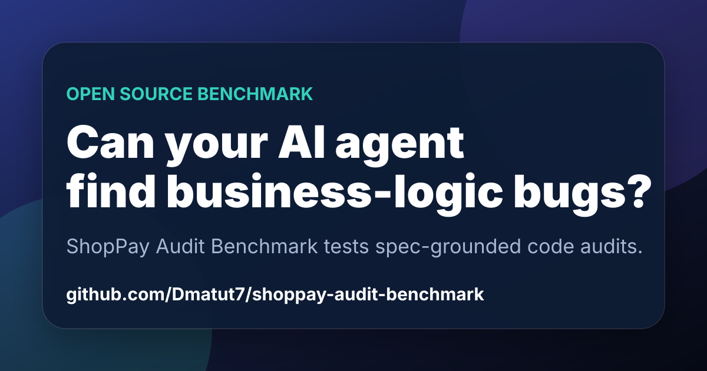

# ShopPay Audit Benchmark

[](https://github.com/Dmatut7/shoppay-audit-benchmark/actions/workflows/test.yml)




Landing page: https://dmatut7.github.io/shoppay-audit-benchmark/

ShopPay Audit Benchmark is a compact, intentionally flawed payment and wallet service for evaluating whether AI coding agents can find **business-logic defects** that happy-path tests miss.

The project is designed for Codex-style audit workflows: read the business rules, inspect the implementation, identify rule violations, and optionally submit a fix with regression tests.

## Why this exists

Many code checks find crashes, missing imports, or syntax errors. Real product failures often come from logic gaps instead:

- refunding the wrong order
- trusting an unsigned webhook
- calculating tax in the wrong order
- allowing profile updates to change privileged fields
- double-spending a wallet balance under concurrency

This repository gives maintainers and AI-agent builders a repeatable target for testing that kind of reasoning.

## What is included

- `SPEC.md` — the source of truth for expected business behavior.
- `src/` — a tiny Node.js service with seeded business-rule defects.
- `test/` — tests that keep the baseline reproducible and prove the seeded defects are present.
- `BENCHMARK.md` — suggested audit task, success criteria, and expected finding categories.
- `.github/workflows/test.yml` — CI for the reproducible baseline.

## Quick start

```bash
npm test
```

No install step is required because the benchmark uses only Node.js built-ins.

## Benchmark workflow

Give an agent this task:

> Read `SPEC.md`, audit `src/`, and report every place where implementation behavior violates the business rules. For each finding, include the violated rule, impacted file/function, reproduction idea, and a minimal fix plan.

A stronger run can ask the agent to implement fixes and add regression tests after the audit report.


## Scoring and examples

- `docs/SCORING.md` defines a 100-point rubric for comparing AI audit reports.
- `examples/audit-report.md` shows the expected report shape and finding detail.
- `docs/ROADMAP.md` tracks planned benchmark cases.
- `docs/PROMOTION.md` contains ready-to-share launch copy.
- `docs/OUTREACH.md` tracks public promotion and directory submissions.

## Project status

Current release: `v0.1.0` baseline benchmark.

This repository is intentionally small. The goal is fast, repeatable audit runs that show whether an AI agent can map implementation behavior back to written business rules.

## Important note about the tests

The default tests are intentionally green against the flawed baseline. Some tests assert the current vulnerable behavior so the benchmark remains reproducible. They are not acceptance tests for a fixed production service.

For a fix branch, replace the baseline-vulnerability assertions with regression tests that enforce `SPEC.md`.

## Business areas covered

- Orders and refund lifecycle
- User authorization
- Payment webhook trust
- Wallet balance and atomic deduction
- Tax and discount ordering
- Profile update privilege boundaries

## Contributing

See `CONTRIBUTING.md` and `docs/ROADMAP.md` for the contribution model and planned benchmark cases.

## License

MIT
